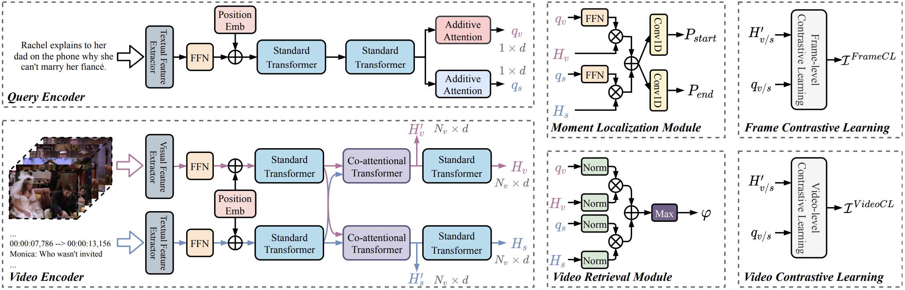

# Video Corpus Moment Retrieval with Contrastive Learning

PyTorch implementation for the paper "Video Corpus Moment Retrieval with Contrastive Learning" (**SIGIR 2021**, 
long paper): [SIGIR version](https://dl.acm.org/doi/10.1145/3404835.3462874), [ArXiv version](
https://arxiv.org/pdf/2105.06247.pdf).



> The codes are modified from [TVRetrieval](https://github.com/jayleicn/TVRetrieval).

## Prerequisites
- python 3.x with pytorch (`1.7.0`), torchvision, transformers, tensorboard, tqdm, h5py, easydict
- cuda, cudnn

If you have [Anaconda](https://www.anaconda.com/distribution/) installed, the conda environment of ReLoCLNet can be 
built as follows (take python 3.7 as an example):
```shell
conda create --name reloclnet python=3.7
conda activate reloclnet
conda install -c anaconda cudatoolkit cudnn  # ignore this if you already have cuda installed
conda install pytorch==1.7.0 torchvision==0.8.0 torchaudio==0.7.0 cudatoolkit=11.0 -c pytorch
conda install -c anaconda h5py=2.9.0
conda install -c conda-forge transformers tensorboard tqdm easydict
```
> The conda environment of [TVRetrieval](https://github.com/jayleicn/TVRetrieval) also works.


## Getting started
1. Clone this repository
```shell
$ git clone git@github.com:IsaacChanghau/ReLoCLNet.git
$ cd ReLoCLNet
```

2. Download features

For the features of TVR dataset, please download [tvr_feature_release.tar.gz](
https://drive.google.com/file/d/1j4mVkXjKCgafW3ReNjZ2Rk6CKx0Fk_n5/view?usp=sharing) (link is copied from 
[TVRetrieval#prerequisites](https://github.com/jayleicn/TVRetrieval#prerequisites)) and extract it to the `data` 
directory:
```shell
$ tar -xf path/to/tvr_feature_release.tar.gz -C data
```
This [link](https://medium.com/@acpanjan/download-google-drive-files-using-wget-3c2c025a8b99) may be useful for you to
directly download Google Drive files using `wget`.  Please refer [TVRetrieval#prerequisites](
https://github.com/jayleicn/TVRetrieval#prerequisites) for more details about how the features are extracted if you are 
interested.

3. Add project root to `PYTHONPATH` (**Note that you need to do this each time you start a new session.**)
```shell
$ source setup.sh
```

## Training and Inference

**TVR dataset**
```shell
# train, refer `method_tvr/scripts/train.sh` and `method_tvr/config.py` more details about hyper-parameters
$ bash method_tvr/scripts/train.sh tvr video_sub_tef resnet_i3d --exp_id reloclnet
# inference
# the model directory placed in method_tvr/results/tvr-video_sub_tef-reloclnet-*
# change the MODEL_DIR_NAME as tvr-video_sub_tef-reloclnet-*
# SPLIT_NAME: [val | test]
$ bash method_tvr/scripts/inference.sh MODEL_DIR_NAME SPLIT_NAME
```

For more details about evaluation and submission, please refer [TVRetrieval#training-and-inference](
https://github.com/jayleicn/TVRetrieval#training-and-inference).

## Citation
If you feel this project helpful to your research, please cite our work.
```
@inproceedings{zhang2021video,
	author = {Zhang, Hao and Sun, Aixin and Jing, Wei and Nan, Guoshun and Zhen, Liangli and Zhou, Joey Tianyi and Goh, Rick Siow Mong},
	title = {Video Corpus Moment Retrieval with Contrastive Learning},
	year = {2021},
	isbn = {9781450380379},
	publisher = {Association for Computing Machinery},
	address = {New York, NY, USA},
	url = {https://doi.org/10.1145/3404835.3462874},
	doi = {10.1145/3404835.3462874},
	booktitle = {Proceedings of the 44th International ACM SIGIR Conference on Research and Development in Information Retrieval},
	pages = {685–695},
	numpages = {11},
	location = {Virtual Event, Canada},
	series = {SIGIR '21}
}
```

## TODO
- Upload codes for ActivityNet Captions dataset
